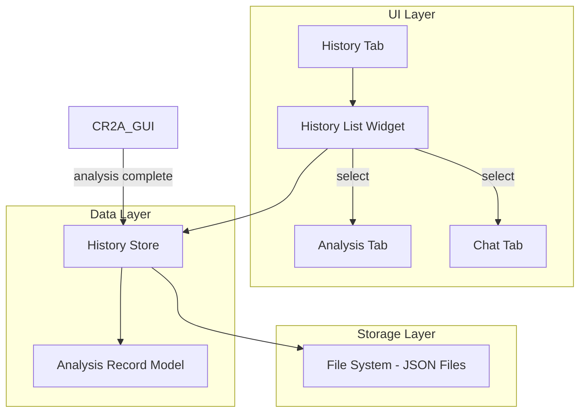

# Design Document: Analysis History

## Overview

This design describes the implementation of persistent analysis history for the CR2A contract analysis application. The feature adds a new History tab to the existing PyQt5 GUI, backed by a JSON-based storage system that persists analysis records to the user's application data directory.

The design follows the existing application patterns:
- PyQt5 widgets for UI components
- JSON file storage (similar to config_manager.py)
- Data models with to_dict/from_dict serialization (similar to analysis_models.py)
- Integration with the existing tab-based navigation in qt_gui.py

## Architecture



### Data Flow

1. **Save Flow**: When analysis completes → CR2A_GUI calls HistoryStore.save() → HistoryStore serializes to JSON → writes to app data directory
2. **Load Flow**: App starts → HistoryStore.load_all() → reads JSON files → deserializes to AnalysisRecord objects → populates History List
3. **Select Flow**: User clicks record → HistoryStore.get() → returns full analysis → CR2A_GUI displays in Analysis tab

## Components and Interfaces

### HistoryStore Class

Location: `src/history_store.py`

```python
class HistoryStore:
    """Manages persistence of analysis records to local storage."""
    
    def __init__(self, storage_dir: Optional[Path] = None):
        """
        Initialize history store.
        
        Args:
            storage_dir: Directory for storing history files.
                        Defaults to %APPDATA%/CR2A/history/
        """
        pass
    
    def save(self, analysis_result: AnalysisResult) -> str:
        """
        Save an analysis result to storage.
        
        Args:
            analysis_result: The completed analysis to save
            
        Returns:
            Unique identifier for the saved record
            
        Raises:
            HistoryStoreError: If save fails
        """
        pass
    
    def load_all(self) -> List[AnalysisRecord]:
        """
        Load all analysis records from storage.
        
        Returns:
            List of AnalysisRecord objects, sorted by date (newest first)
        """
        pass
    
    def get(self, record_id: str) -> Optional[AnalysisResult]:
        """
        Get full analysis result by record ID.
        
        Args:
            record_id: Unique identifier of the record
            
        Returns:
            Full AnalysisResult or None if not found
        """
        pass
    
    def delete(self, record_id: str) -> bool:
        """
        Delete an analysis record.
        
        Args:
            record_id: Unique identifier of the record
            
        Returns:
            True if deleted, False if not found
            
        Raises:
            HistoryStoreError: If deletion fails
        """
        pass
    
    def get_summary(self, record_id: str) -> Optional[AnalysisSummary]:
        """
        Get summary information for a record without loading full data.
        
        Args:
            record_id: Unique identifier of the record
            
        Returns:
            AnalysisSummary or None if not found
        """
        pass
```

### HistoryTab Class

Location: `src/history_tab.py`

```python
class HistoryTab(QWidget):
    """History tab widget for displaying past analyses."""
    
    # Signals
    analysis_selected = pyqtSignal(str)  # Emits record_id when selected
    analysis_deleted = pyqtSignal(str)   # Emits record_id when deleted
    
    def __init__(self, history_store: HistoryStore, parent=None):
        """
        Initialize history tab.
        
        Args:
            history_store: HistoryStore instance for data access
            parent: Parent widget
        """
        pass
    
    def refresh(self) -> None:
        """Refresh the history list from storage."""
        pass
    
    def add_record(self, record: AnalysisRecord) -> None:
        """
        Add a new record to the list without full refresh.
        
        Args:
            record: The new analysis record to add
        """
        pass
    
    def remove_record(self, record_id: str) -> None:
        """
        Remove a record from the list.
        
        Args:
            record_id: ID of record to remove
        """
        pass
```

### Integration with CR2A_GUI

The main GUI class will be extended to:

1. Create HistoryStore instance during initialization
2. Add History tab to the tab widget
3. Connect analysis completion to history save
4. Handle history selection to load and display analysis

```python
# In CR2A_GUI.__init__
self.history_store = HistoryStore()

# In CR2A_GUI.init_ui (after creating tabs)
self.history_tab = HistoryTab(self.history_store)
self.tabs.addTab(self.history_tab, "📜 History")

# Connect signals
self.history_tab.analysis_selected.connect(self.on_history_selected)
self.history_tab.analysis_deleted.connect(self.on_history_deleted)

# In on_analysis_complete
record_id = self.history_store.save(result)
self.history_tab.add_record(self.history_store.get_summary(record_id))
```

## Data Models

### AnalysisRecord

A lightweight record for list display, containing summary information.

```python
@dataclass
class AnalysisRecord:
    """Summary record for an analysis, used in history list."""
    
    id: str                    # Unique identifier (UUID)
    filename: str              # Contract filename
    analyzed_at: datetime      # When analysis was performed
    clause_count: int          # Number of clauses found
    risk_count: int            # Number of risks identified
    file_path: Path            # Path to full analysis JSON file
    
    def to_dict(self) -> Dict[str, Any]:
        """Convert to dictionary for JSON serialization."""
        return {
            'id': self.id,
            'filename': self.filename,
            'analyzed_at': self.analyzed_at.isoformat(),
            'clause_count': self.clause_count,
            'risk_count': self.risk_count,
            'file_path': str(self.file_path)
        }
    
    @classmethod
    def from_dict(cls, data: Dict[str, Any]) -> 'AnalysisRecord':
        """Create from dictionary."""
        return cls(
            id=data['id'],
            filename=data['filename'],
            analyzed_at=datetime.fromisoformat(data['analyzed_at']),
            clause_count=data['clause_count'],
            risk_count=data['risk_count'],
            file_path=Path(data['file_path'])
        )
```

### AnalysisSummary

Alias for AnalysisRecord - used interchangeably for clarity in different contexts.

### Storage File Format

Each analysis is stored as a separate JSON file:

```
%APPDATA%/CR2A/history/
├── index.json              # Index of all records (AnalysisRecord list)
├── {uuid1}.json           # Full analysis result 1
├── {uuid2}.json           # Full analysis result 2
└── ...
```

**index.json structure:**
```json
{
  "version": "1.0",
  "records": [
    {
      "id": "uuid-string",
      "filename": "contract.pdf",
      "analyzed_at": "2024-01-15T10:30:00",
      "clause_count": 15,
      "risk_count": 3,
      "file_path": "uuid-string.json"
    }
  ]
}
```

**{uuid}.json structure:**
Same as AnalysisResult.to_dict() output, with additional wrapper:
```json
{
  "version": "1.0",
  "record_id": "uuid-string",
  "analysis": { /* AnalysisResult.to_dict() */ }
}
```


## Correctness Properties

*A property is a characteristic or behavior that should hold true across all valid executions of a system—essentially, a formal statement about what the system should do. Properties serve as the bridge between human-readable specifications and machine-verifiable correctness guarantees.*

### Property 1: Save-Load Round Trip

*For any* valid AnalysisResult, saving it to the HistoryStore and then loading it back by its ID SHALL produce an equivalent AnalysisResult with all fields preserved (contract metadata, clauses, risks, compliance issues, redlining suggestions).

**Validates: Requirements 1.2, 1.3, 4.1, 6.3**

### Property 2: Corrupted Record Isolation

*For any* set of saved analysis records where some records have corrupted JSON files, loading all records SHALL return all valid records while skipping corrupted ones, and the count of loaded records SHALL equal the count of non-corrupted files.

**Validates: Requirements 1.5**

### Property 3: History List Display Completeness

*For any* AnalysisRecord, when rendered in the History_List, the displayed text SHALL contain the contract filename, the formatted analysis date/time, and the clause count.

**Validates: Requirements 3.1**

### Property 4: History List Ordering

*For any* list of AnalysisRecords returned by load_all(), for each consecutive pair of records (record[i], record[i+1]), record[i].analyzed_at SHALL be greater than or equal to record[i+1].analyzed_at (newest first ordering).

**Validates: Requirements 3.2**

### Property 5: Dynamic List Update Invariant

*For any* History_List with N records, after adding a new AnalysisRecord, the list SHALL contain exactly N+1 records, and the new record SHALL be present in the list.

**Validates: Requirements 3.3**

### Property 6: Deletion Removes Record

*For any* AnalysisRecord that exists in the HistoryStore, after successful deletion, calling get() with that record's ID SHALL return None, and load_all() SHALL not include that record.

**Validates: Requirements 5.3**

### Property 7: File Naming Convention

*For any* saved AnalysisRecord with ID X, the storage file path SHALL end with "{X}.json" where X is the record's unique identifier.

**Validates: Requirements 6.2**

### Property 8: Deserialization Validation

*For any* JSON data that is missing required fields (id, filename, analyzed_at, or analysis data), the HistoryStore SHALL reject the data during load and not include it in the returned records.

**Validates: Requirements 6.4**

## Error Handling

### Save Errors

| Error Condition | Handling Strategy |
|----------------|-------------------|
| Disk full | Log error, show user notification, return None instead of record ID |
| Permission denied | Log error, show user notification, suggest checking folder permissions |
| Serialization failure | Log error with details, show user notification, do not save partial data |

### Load Errors

| Error Condition | Handling Strategy |
|----------------|-------------------|
| Index file missing | Create empty index, return empty list |
| Index file corrupted | Log warning, attempt to rebuild from individual files |
| Individual file corrupted | Log warning, skip record, continue loading others |
| Individual file missing | Log warning, remove from index, continue loading |

### Delete Errors

| Error Condition | Handling Strategy |
|----------------|-------------------|
| File not found | Log warning, remove from index anyway, return True |
| Permission denied | Log error, show user notification, return False |
| Index update failure | Log error, attempt rollback, show user notification |

### UI Error Display

Errors are displayed using QMessageBox with appropriate severity:
- **Critical**: Unrecoverable errors (e.g., storage directory inaccessible)
- **Warning**: Recoverable errors (e.g., single file corrupted)
- **Information**: User notifications (e.g., record deleted successfully)

## Testing Strategy

### Unit Tests

Unit tests focus on individual component behavior:

1. **HistoryStore Tests** (`tests/unit/test_history_store.py`)
   - Test save creates file with correct structure
   - Test load returns correct data
   - Test delete removes file
   - Test get_summary returns correct fields
   - Test error handling for various failure modes

2. **AnalysisRecord Tests** (`tests/unit/test_analysis_record.py`)
   - Test to_dict serialization
   - Test from_dict deserialization
   - Test validation of required fields

3. **HistoryTab Tests** (`tests/unit/test_history_tab.py`)
   - Test widget initialization
   - Test refresh populates list
   - Test add_record updates list
   - Test remove_record updates list
   - Test signal emission on selection

### Property-Based Tests

Property-based tests use the `hypothesis` library to verify universal properties across many generated inputs. Each test runs a minimum of 100 iterations.

Location: `tests/property/test_history_properties.py`

**Test Configuration:**
```python
from hypothesis import given, settings, strategies as st

@settings(max_examples=100)
```

**Property Test Implementations:**

1. **Feature: analysis-history, Property 1: Save-Load Round Trip**
   - Generate random AnalysisResult objects
   - Save to HistoryStore, load back by ID
   - Assert loaded result equals original

2. **Feature: analysis-history, Property 2: Corrupted Record Isolation**
   - Generate list of valid records, save all
   - Corrupt random subset of files
   - Load all, assert valid records returned

3. **Feature: analysis-history, Property 3: History List Display Completeness**
   - Generate random AnalysisRecord
   - Render to display string
   - Assert string contains filename, date, clause count

4. **Feature: analysis-history, Property 4: History List Ordering**
   - Generate list of records with random dates
   - Call load_all()
   - Assert each record's date >= next record's date

5. **Feature: analysis-history, Property 5: Dynamic List Update Invariant**
   - Generate initial list of N records
   - Add new record
   - Assert list length is N+1 and new record present

6. **Feature: analysis-history, Property 6: Deletion Removes Record**
   - Generate and save record
   - Delete record
   - Assert get() returns None and load_all() excludes it

7. **Feature: analysis-history, Property 7: File Naming Convention**
   - Generate and save record with known ID
   - Assert file path ends with "{ID}.json"

8. **Feature: analysis-history, Property 8: Deserialization Validation**
   - Generate JSON with missing required fields
   - Attempt to load
   - Assert record is rejected/not included

### Integration Tests

Location: `tests/integration/test_history_integration.py`

1. **Full Workflow Test**
   - Complete analysis → auto-save → restart simulation → load history → select record → verify display

2. **Multi-Record Management**
   - Save multiple analyses → verify ordering → delete some → verify remaining

3. **Error Recovery Test**
   - Simulate storage errors → verify graceful handling → verify app continues working
