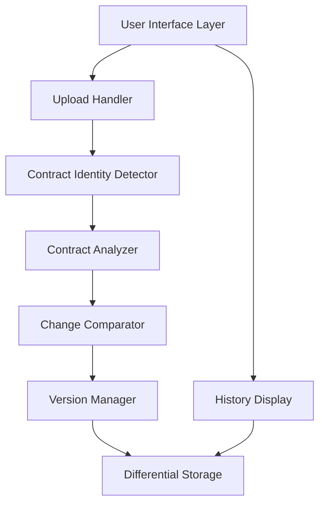

# Design Document: Contract Change Tracking & Differential Versioning

## Overview

The Contract Change Tracking & Differential Versioning feature enables the CR2A application to track contract evolution over time using a differential storage approach. Instead of storing complete duplicates when a contract is re-analyzed, the system stores only the changes (deltas) at the clause level, assigns version numbers, and provides a comprehensive history view with change visualization.

The design follows a layered architecture with clear separation between identity detection, change comparison, storage, and presentation layers. The system uses content-based hashing for duplicate detection, text similarity algorithms for clause comparison, and a versioned data model that stores only deltas while enabling efficient reconstruction of any historical version.

## Architecture

### High-Level Architecture



### Component Interaction Flow

**New Contract Upload:**
1. User uploads contract → Upload Handler
2. Upload Handler → Contract Identity Detector (compute hash, check for matches)
3. If no match → Contract Analyzer (analyze as new, version 1)
4. Contract Analyzer → Differential Storage (store with version 1)

**Updated Contract Upload:**
1. User uploads contract → Upload Handler
2. Upload Handler → Contract Identity Detector (detect match)
3. Identity Detector → UI (prompt user for confirmation)
4. User confirms update → Contract Analyzer (analyze new version)
5. Contract Analyzer → Change Comparator (compare with previous version)
6. Change Comparator → Version Manager (assign version numbers)
7. Version Manager → Differential Storage (store only deltas)

**Version Retrieval:**
1. User requests version → History Display
2. History Display → Differential Storage (retrieve version data)
3. Differential Storage → Version Manager (reconstruct version state)
4. Version Manager → History Display (return complete version)

## Components and Interfaces

### 1. Contract Identity Detector

**Responsibility:** Detect when an uploaded contract matches a previously analyzed contract.

**Interface:**
```python
class ContractIdentityDetector:
    def compute_file_hash(self, file_path: str) -> str:
        """Compute SHA-256 hash of file content."""
        pass
    
    def find_potential_matches(self, file_hash: str, filename: str) -> List[ContractMatch]:
        """Find contracts that might match based on hash or filename similarity."""
        pass
    
    def calculate_filename_similarity(self, name1: str, name2: str) -> float:
        """Calculate similarity score between filenames (0.0 to 1.0)."""
        pass
```

**Implementation Details:**
- Uses SHA-256 for file hashing (cryptographically secure, collision-resistant)
- Uses Levenshtein distance for filename similarity (normalized to 0.0-1.0 range)
- Threshold for filename matching: 0.8 (80% similarity)
- Queries storage layer for existing contracts with matching hashes or similar names

### 2. Change Comparator

**Responsibility:** Compare two versions of a contract and identify changes at the clause level.

**Interface:**
```python
class ChangeComparator:
    def compare_contracts(self, old_analysis: ContractAnalysis, 
                         new_analysis: ContractAnalysis) -> ContractDiff:
        """Compare two contract analyses and return differences."""
        pass
    
    def compare_clauses(self, old_clause: Clause, new_clause: Clause) -> ClauseChangeType:
        """Determine if a clause is unchanged, modified, added, or deleted."""
        pass
    
    def calculate_text_similarity(self, text1: str, text2: str) -> float:
        """Calculate similarity between two text strings (0.0 to 1.0)."""
        pass
    
    def normalize_text(self, text: str) -> str:
        """Normalize text for comparison (whitespace, case)."""
        pass
```

**Implementation Details:**
- Uses difflib.SequenceMatcher for text similarity calculation
- Normalization: lowercase, collapse whitespace, strip leading/trailing whitespace
- Change threshold: 5% difference (similarity < 0.95 = modified)
- Clause matching strategy:
  1. First, try to match by clause identifier/title
  2. If no identifier match, use text similarity
  3. Clauses with similarity >= 0.95 are considered "same clause, unchanged"
  4. Clauses with similarity < 0.95 are considered "same clause, modified"
  5. Unmatched clauses in new version are "added"
  6. Unmatched clauses in old version are "deleted"

### 3. Version Manager

**Responsibility:** Manage version numbers and track which clauses changed in each version.

**Interface:**
```python
class VersionManager:
    def get_next_version(self, contract_id: str) -> int:
        """Get the next version number for a contract."""
        pass
    
    def assign_clause_versions(self, contract_diff: ContractDiff, 
                              new_version: int) -> VersionedContract:
        """Assign version numbers to clauses based on changes."""
        pass
    
    def get_version_metadata(self, contract_id: str, version: int) -> VersionMetadata:
        """Get metadata for a specific version."""
        pass
    
    def reconstruct_version(self, contract_id: str, version: int) -> ContractAnalysis:
        """Reconstruct the complete contract state at a specific version."""
        pass
```

**Implementation Details:**
- Version numbers are sequential integers starting at 1
- Each version has metadata: version number, timestamp (ISO 8601), list of changed clause IDs
- Clause version assignment:
  - Unchanged clauses: keep existing version number
  - Modified clauses: assign new contract version number
  - Added clauses: assign new contract version number
  - Deleted clauses: mark with deletion flag and version number
- Version reconstruction algorithm:
  1. Retrieve all clauses for the contract
  2. Filter clauses where clause_version <= requested_version
  3. Exclude clauses marked as deleted at or before requested_version
  4. Group by clause identifier, take the latest version <= requested_version
  5. Assemble into complete contract structure

### 4. Differential Storage

**Responsibility:** Store contract data with differential versioning, maintaining only changes.

**Data Model:**
```python
@dataclass
class Contract:
    contract_id: str
    filename: str
    file_hash: str
    current_version: int
    created_at: datetime
    updated_at: datetime

@dataclass
class Clause:
    clause_id: str
    contract_id: str
    clause_version: int
    clause_identifier: str  # e.g., "Section 2.1", "Termination Clause"
    content: str
    metadata: Dict[str, Any]  # Risk level, category, etc.
    created_at: datetime
    is_deleted: bool
    deleted_at: Optional[datetime]

@dataclass
class VersionMetadata:
    contract_id: str
    version: int
    timestamp: datetime
    changed_clause_ids: List[str]
    change_summary: Dict[str, int]  # {"modified": 3, "added": 1, "deleted": 0}
```

**Interface:**
```python
class DifferentialStorage:
    def store_new_contract(self, contract: Contract, clauses: List[Clause]) -> None:
        """Store a new contract with version 1."""
        pass
    
    def store_contract_version(self, contract_id: str, version: int,
                              changed_clauses: List[Clause],
                              version_metadata: VersionMetadata) -> None:
        """Store a new version with only changed clauses."""
        pass
    
    def get_contract(self, contract_id: str) -> Contract:
        """Retrieve contract metadata."""
        pass
    
    def get_clauses(self, contract_id: str, version: Optional[int] = None) -> List[Clause]:
        """Retrieve clauses for a contract, optionally filtered by version."""
        pass
    
    def get_version_history(self, contract_id: str) -> List[VersionMetadata]:
        """Get all version metadata for a contract."""
        pass
```

**Implementation Details:**
- Storage backend: SQLite or PostgreSQL (depending on deployment)
- Indexes on: contract_id, file_hash, (contract_id, clause_version)
- Transaction support for atomic version updates
- Clause storage strategy:
  - Store only one row per clause per version
  - Unchanged clauses are not duplicated
  - Modified clauses create new rows with incremented version
  - Deleted clauses are marked with is_deleted flag

### 5. History Display

**Responsibility:** Present contract history and version information in the UI.

**Interface:**
```python
class HistoryDisplay:
    def get_contract_list(self) -> List[ContractSummary]:
        """Get list of all contracts with current version info."""
        pass
    
    def get_version_list(self, contract_id: str) -> List[VersionSummary]:
        """Get list of all versions for a contract."""
        pass
    
    def get_version_comparison(self, contract_id: str, 
                              version1: int, version2: int) -> VersionComparison:
        """Get detailed comparison between two versions."""
        pass
    
    def render_diff(self, old_text: str, new_text: str) -> str:
        """Render text diff with HTML highlighting."""
        pass
```

**UI Components:**
- Contract list view: Shows one entry per contract with current version and change count
- Version selector: Dropdown or timeline showing all available versions
- Comparison view: Side-by-side or unified diff view
- Change highlighting: Color-coded (green=added, yellow=modified, red=deleted)
- Version timeline: Visual representation of version history with timestamps

## Data Models

### Contract Table
```sql
CREATE TABLE contracts (
    contract_id TEXT PRIMARY KEY,
    filename TEXT NOT NULL,
    file_hash TEXT NOT NULL,
    current_version INTEGER NOT NULL DEFAULT 1,
    created_at TIMESTAMP NOT NULL,
    updated_at TIMESTAMP NOT NULL,
    INDEX idx_file_hash (file_hash)
);
```

### Clause Table
```sql
CREATE TABLE clauses (
    clause_id TEXT PRIMARY KEY,
    contract_id TEXT NOT NULL,
    clause_version INTEGER NOT NULL,
    clause_identifier TEXT,
    content TEXT NOT NULL,
    metadata JSON,
    created_at TIMESTAMP NOT NULL,
    is_deleted BOOLEAN DEFAULT FALSE,
    deleted_at TIMESTAMP,
    FOREIGN KEY (contract_id) REFERENCES contracts(contract_id),
    INDEX idx_contract_version (contract_id, clause_version)
);
```

### Version Metadata Table
```sql
CREATE TABLE version_metadata (
    contract_id TEXT NOT NULL,
    version INTEGER NOT NULL,
    timestamp TIMESTAMP NOT NULL,
    changed_clause_ids JSON NOT NULL,
    change_summary JSON NOT NULL,
    PRIMARY KEY (contract_id, version),
    FOREIGN KEY (contract_id) REFERENCES contracts(contract_id)
);
```


## Correctness Properties

A property is a characteristic or behavior that should hold true across all valid executions of a system—essentially, a formal statement about what the system should do. Properties serve as the bridge between human-readable specifications and machine-verifiable correctness guarantees.

### Property 1: File Hash Consistency
*For any* file content, computing the hash multiple times should always produce the same hash value.
**Validates: Requirements 1.1**

### Property 2: Hash-Based Duplicate Detection
*For any* contract with a stored file hash, uploading a file with the same hash should be identified as a potential duplicate.
**Validates: Requirements 1.2**

### Property 3: Filename Similarity Detection
*For any* pair of filenames with similarity score >= 0.8, the Contract_Identity_Detector should identify them as potential matches.
**Validates: Requirements 1.3**

### Property 4: Single Contract Record Per ID
*For any* contract ID, regardless of the number of versions, there should exist exactly one contract record in storage.
**Validates: Requirements 2.1**

### Property 5: Unchanged Clause Non-Duplication
*For any* clause that remains unchanged between versions, the clause data should not be duplicated in storage (same clause_id, same version number).
**Validates: Requirements 2.2**

### Property 6: Modified Clause Version Increment
*For any* clause that is modified between versions, the new clause should have a version number greater than the previous version.
**Validates: Requirements 2.3**

### Property 7: Added Clause Version Assignment
*For any* clause added in a new version, the clause should have a version number equal to the current contract version.
**Validates: Requirements 2.4**

### Property 8: Deleted Clause Preservation
*For any* clause marked as deleted, the clause data should still exist in storage with is_deleted flag set to true.
**Validates: Requirements 2.5**

### Property 9: Clause Metadata Completeness
*For any* stored clause, the clause must have version metadata including version number and timestamp.
**Validates: Requirements 2.6**

### Property 10: Initial Version Assignment
*For any* newly analyzed contract, all clauses should be assigned version number 1.
**Validates: Requirements 3.1**

### Property 11: Contract Version Increment
*For any* contract that is re-analyzed with changes, the new contract version should be exactly one greater than the previous version.
**Validates: Requirements 3.2**

### Property 12: Modified Clause Version Tracking
*For any* clause modified in a new version, the clause version should equal the new contract version.
**Validates: Requirements 3.3**

### Property 13: Unchanged Clause Version Preservation
*For any* clause that is unchanged between versions, the clause version should remain the same as before.
**Validates: Requirements 3.4**

### Property 14: Timestamp Format Validity
*For any* version change, the recorded timestamp should be a valid ISO 8601 formatted string.
**Validates: Requirements 3.5**

### Property 15: Change Tracking Completeness
*For any* version, the version metadata should include the IDs of all clauses that changed in that version.
**Validates: Requirements 3.6**

### Property 16: Modification Classification Threshold
*For any* pair of clauses with text similarity < 0.95, the Change_Comparator should classify them as modified.
**Validates: Requirements 4.2**

### Property 17: Addition Detection
*For any* clause that exists in the new version but not in the old version, the Change_Comparator should classify it as an addition.
**Validates: Requirements 4.3**

### Property 18: Deletion Detection
*For any* clause that exists in the old version but not in the new version, the Change_Comparator should classify it as a deletion.
**Validates: Requirements 4.4**

### Property 19: Unchanged Classification Threshold
*For any* pair of clauses with text similarity >= 0.95, the Change_Comparator should classify them as unchanged.
**Validates: Requirements 4.5**

### Property 20: Text Normalization Invariance
*For any* two text strings that differ only in whitespace or case, the normalized versions should be identical.
**Validates: Requirements 4.6**

### Property 21: Unique Contract Entries
*For any* set of contracts in the system, the History_Display should show exactly one entry per unique contract_id.
**Validates: Requirements 5.1**

### Property 22: Current Version Display Accuracy
*For any* contract displayed in history, the shown version number should match the contract's current_version field.
**Validates: Requirements 5.2**

### Property 23: Versioned Clause Count Accuracy
*For any* contract, the count of clauses with multiple versions should equal the number of distinct clause_ids that have more than one version record.
**Validates: Requirements 5.3**

### Property 24: Complete Version Listing
*For any* contract, the list of available versions should include all version numbers from 1 to current_version.
**Validates: Requirements 5.4**

### Property 25: Version Reconstruction Accuracy
*For any* contract and version number, reconstructing that version should produce a contract state that matches what was stored at that version.
**Validates: Requirements 7.1, 7.2, 7.3, 7.4**

### Property 26: Text Diff Completeness
*For any* pair of text strings, the diff output should highlight all differences between them.
**Validates: Requirements 6.5**

### Property 27: Change Summary Accuracy
*For any* version comparison, the change summary counts (modified, added, deleted) should match the actual number of clauses in each category.
**Validates: Requirements 6.6**

### Property 28: Sequential Version Validation
*For any* new version being stored, the version number should be exactly one greater than the previous maximum version for that contract.
**Validates: Requirements 8.1**

### Property 29: Metadata Completeness Validation
*For any* clause being stored, all required version metadata fields (version, timestamp, contract_id) must be non-null.
**Validates: Requirements 8.2**

### Property 30: Transaction Atomicity
*For any* storage operation that fails, the database state should be identical to the state before the operation began (no partial updates).
**Validates: Requirements 8.3**

### Property 31: Referential Integrity
*For any* clause in the system, the referenced contract_id must exist in the contracts table.
**Validates: Requirements 8.4**

## Error Handling

### Error Scenarios and Responses

1. **File Hash Computation Failure**
   - Scenario: File is corrupted or unreadable
   - Response: Return error to user with message "Unable to process file. Please ensure the file is not corrupted."
   - Logging: Log file path and error details

2. **Duplicate Detection Ambiguity**
   - Scenario: Multiple potential matches found (hash match + multiple filename matches)
   - Response: Present all potential matches to user for selection
   - Fallback: Allow user to proceed as new contract if uncertain

3. **Comparison Failure**
   - Scenario: Contract structure is incompatible between versions
   - Response: Log warning and proceed with best-effort comparison
   - Fallback: Treat all clauses as modified if comparison cannot be performed

4. **Storage Transaction Failure**
   - Scenario: Database error during version storage
   - Response: Rollback transaction, return error to user
   - Retry: Allow user to retry the operation
   - Logging: Log full error stack trace for debugging

5. **Version Reconstruction Failure**
   - Scenario: Missing clause data for requested version
   - Response: Return error indicating data corruption
   - Recovery: Attempt to reconstruct from available data with warning

6. **Invalid Version Number**
   - Scenario: Attempt to store non-sequential version
   - Response: Reject operation with validation error
   - Logging: Log the attempted version and current version

7. **Referential Integrity Violation**
   - Scenario: Clause references non-existent contract
   - Response: Reject operation with foreign key error
   - Prevention: Validate contract_id exists before storing clauses

### Error Recovery Strategies

- **Graceful Degradation**: If comparison fails, fall back to treating entire contract as new version
- **Data Validation**: Validate all inputs before storage operations
- **Transaction Boundaries**: Wrap all multi-step operations in database transactions
- **Audit Logging**: Log all errors with sufficient context for debugging
- **User Feedback**: Provide clear, actionable error messages to users

## Testing Strategy

### Dual Testing Approach

This feature requires both unit testing and property-based testing for comprehensive coverage:

- **Unit tests**: Verify specific examples, edge cases, and error conditions
- **Property tests**: Verify universal properties across all inputs

### Property-Based Testing

We will use **Hypothesis** (Python) for property-based testing. Each correctness property will be implemented as a property-based test with minimum 100 iterations.

**Test Configuration:**
```python
from hypothesis import given, settings
import hypothesis.strategies as st

@settings(max_examples=100)
@given(file_content=st.binary())
def test_property_1_file_hash_consistency(file_content):
    """
    Feature: contract-change-tracking
    Property 1: For any file content, computing the hash multiple times 
    should always produce the same hash value.
    """
    # Test implementation
    pass
```

**Property Test Coverage:**
- All 31 correctness properties will have corresponding property-based tests
- Each test will run minimum 100 iterations with randomized inputs
- Tests will use Hypothesis strategies to generate:
  - Random file contents
  - Random contract structures
  - Random clause texts
  - Random version numbers
  - Random timestamps

### Unit Testing

**Unit Test Focus Areas:**

1. **Contract Identity Detector**
   - Test hash computation with known files
   - Test filename similarity with specific examples
   - Test edge cases: empty files, very large files, special characters in filenames

2. **Change Comparator**
   - Test specific clause comparisons with known similarity scores
   - Test edge cases: empty clauses, very long clauses, special characters
   - Test normalization with specific examples

3. **Version Manager**
   - Test version assignment with specific scenarios
   - Test reconstruction with known version states
   - Test edge cases: version 1, large version numbers, gaps in versions

4. **Differential Storage**
   - Test storage operations with specific data
   - Test transaction rollback scenarios
   - Test edge cases: empty contracts, contracts with no clauses

5. **History Display**
   - Test UI data preparation with specific contracts
   - Test diff rendering with known text pairs
   - Test edge cases: contracts with no versions, contracts with many versions

**Integration Testing:**
- End-to-end workflow: Upload → Detect → Compare → Store → Retrieve
- Multi-version scenarios: Create 5+ versions and verify reconstruction
- Error scenarios: Simulate failures at each step and verify recovery

### Test Data Generation

**For Property-Based Tests:**
- Use Hypothesis strategies to generate random but valid data
- Constrain generation to realistic ranges (e.g., 1-100 clauses per contract)
- Generate edge cases automatically (empty strings, boundary values)

**For Unit Tests:**
- Create fixture files with known content and hashes
- Create sample contracts with known clause structures
- Create version scenarios with known expected outcomes

### Performance Testing

While not part of automated testing, performance should be validated manually:
- Test with contracts containing 100+ clauses
- Test with 10+ versions of the same contract
- Measure comparison time, storage time, and retrieval time
- Verify performance requirements (2-5 seconds) are met
