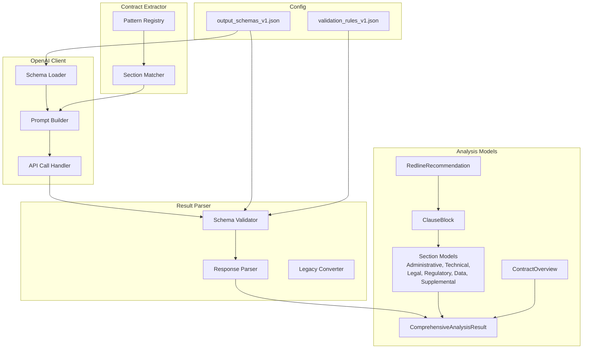

# Design Document: Schema Alignment

## Overview

This design addresses the mismatch between the comprehensive 8-section output schema (`output_schemas_v1.json`) and the simplified schema currently used in the OpenAI client. The solution involves:

1. Updating data models to support the ClauseBlock structure and all 8 sections
2. Modifying the OpenAI client to load and use the comprehensive schema
3. Updating the result parser to handle the new response structure
4. Expanding contract extractor patterns to cover all 61+ clause categories
5. Adding schema validation for API responses
6. Maintaining backward compatibility with existing analysis results

## Architecture



## Components and Interfaces

### 1. Schema Loader Component

Responsible for loading and caching the comprehensive schema from `output_schemas_v1.json`.

```python
class SchemaLoader:
    """Loads and caches the output schema from configuration."""
    
    def __init__(self, schema_path: str = "config/output_schemas_v1.json"):
        self._schema_path = schema_path
        self._schema: Optional[Dict] = None
        self._clause_categories: Optional[Dict[str, List[str]]] = None
    
    def load_schema(self) -> Dict:
        """Load schema from file, caching for subsequent calls."""
        pass
    
    def get_clause_categories(self) -> Dict[str, List[str]]:
        """Extract clause category names organized by section."""
        pass
    
    def get_schema_for_prompt(self) -> str:
        """Generate schema description suitable for AI prompt."""
        pass
    
    def get_clause_block_schema(self) -> Dict:
        """Return the ClauseBlock definition from $defs."""
        pass
```

### 2. Enhanced OpenAI Client

Updated client that uses the comprehensive schema for prompts.

```python
class OpenAIClient:
    """Client for contract analysis using comprehensive schema."""
    
    def __init__(self, api_key: str, model: str = "gpt-4o"):
        self._schema_loader = SchemaLoader()
        # ... existing initialization
    
    def _build_system_message(self) -> str:
        """Build system message with comprehensive analysis instructions."""
        pass
    
    def _build_user_message(self, contract_text: str) -> str:
        """Build user message with full schema structure."""
        pass
    
    def _build_schema_instructions(self) -> str:
        """Generate detailed schema instructions for the AI."""
        pass
```

### 3. Data Models

#### ClauseBlock and RedlineRecommendation

```python
@dataclass
class RedlineRecommendation:
    """A structured redline recommendation."""
    action: str  # "insert", "replace", "delete"
    text: str
    reference: Optional[str] = None
    
    def to_dict(self) -> Dict[str, Any]: ...
    
    @classmethod
    def from_dict(cls, data: Dict[str, Any]) -> 'RedlineRecommendation': ...


@dataclass
class ClauseBlock:
    """Analysis block for a single clause category."""
    clause_language: str
    clause_summary: str
    risk_triggers_identified: List[str]
    flow_down_obligations: List[str]
    redline_recommendations: List[RedlineRecommendation]
    harmful_language_policy_conflicts: List[str]
    
    def to_dict(self) -> Dict[str, Any]: ...
    
    @classmethod
    def from_dict(cls, data: Dict[str, Any]) -> 'ClauseBlock': ...
```

#### ContractOverview

```python
@dataclass
class ContractOverview:
    """Section I: Contract Overview with 8 required fields."""
    project_title: str
    solicitation_no: str
    owner: str
    contractor: str
    scope: str
    general_risk_level: str  # "Low", "Medium", "High", "Critical"
    bid_model: str  # "Lump Sum", "Unit Price", etc.
    notes: str
    
    def to_dict(self) -> Dict[str, Any]: ...
    
    @classmethod
    def from_dict(cls, data: Dict[str, Any]) -> 'ContractOverview': ...
```

#### Section Models

```python
@dataclass
class AdministrativeAndCommercialTerms:
    """Section II: Administrative & Commercial Terms (16 clause types)."""
    contract_term_renewal_extensions: Optional[ClauseBlock] = None
    bonding_surety_insurance: Optional[ClauseBlock] = None
    retainage_progress_payments: Optional[ClauseBlock] = None
    pay_when_paid: Optional[ClauseBlock] = None
    price_escalation: Optional[ClauseBlock] = None
    fuel_price_adjustment: Optional[ClauseBlock] = None
    change_orders: Optional[ClauseBlock] = None
    termination_for_convenience: Optional[ClauseBlock] = None
    termination_for_cause: Optional[ClauseBlock] = None
    bid_protest_procedures: Optional[ClauseBlock] = None
    bid_tabulation: Optional[ClauseBlock] = None
    contractor_qualification: Optional[ClauseBlock] = None
    release_orders: Optional[ClauseBlock] = None
    assignment_novation: Optional[ClauseBlock] = None
    audit_rights: Optional[ClauseBlock] = None
    notice_requirements: Optional[ClauseBlock] = None
    
    # Similar pattern for other sections...
```

#### ComprehensiveAnalysisResult

```python
@dataclass
class ComprehensiveAnalysisResult:
    """Complete analysis result matching output_schemas_v1.json."""
    schema_version: str
    contract_overview: ContractOverview
    administrative_and_commercial_terms: AdministrativeAndCommercialTerms
    technical_and_performance_terms: TechnicalAndPerformanceTerms
    legal_risk_and_enforcement: LegalRiskAndEnforcement
    regulatory_and_compliance_terms: RegulatoryAndComplianceTerms
    data_technology_and_deliverables: DataTechnologyAndDeliverables
    supplemental_operational_risks: List[ClauseBlock]
    
    # Metadata for internal tracking
    metadata: ContractMetadata
    
    def to_dict(self) -> Dict[str, Any]: ...
    
    @classmethod
    def from_dict(cls, data: Dict[str, Any]) -> 'ComprehensiveAnalysisResult': ...
    
    def validate(self) -> bool: ...
```

### 4. Schema Validator

```python
class SchemaValidator:
    """Validates API responses against the output schema."""
    
    def __init__(self, schema_loader: SchemaLoader):
        self._schema_loader = schema_loader
        self._validator: Optional[jsonschema.Validator] = None
    
    def validate(self, response: Dict) -> ValidationResult:
        """Validate response against schema, returning detailed results."""
        pass
    
    def validate_clause_block(self, block: Dict) -> List[str]:
        """Validate a single clause block, returning list of errors."""
        pass
    
    def validate_enum_field(self, value: str, field_name: str) -> bool:
        """Validate enum fields like risk_level, bid_model, action."""
        pass


@dataclass
class ValidationResult:
    """Result of schema validation."""
    is_valid: bool
    errors: List[ValidationError]
    warnings: List[str]
    
    
@dataclass
class ValidationError:
    """A specific validation error."""
    path: str
    message: str
    value: Any
```

### 5. Enhanced Result Parser

```python
class ComprehensiveResultParser:
    """Parses API responses into ComprehensiveAnalysisResult objects."""
    
    def __init__(self, schema_validator: SchemaValidator):
        self._validator = schema_validator
    
    def parse_api_response(
        self,
        api_response: Dict[str, Any],
        filename: str,
        file_size_bytes: int,
        page_count: Optional[int] = None
    ) -> ComprehensiveAnalysisResult:
        """Parse and validate API response into result object."""
        pass
    
    def _parse_contract_overview(self, data: Dict) -> ContractOverview:
        """Parse Section I: Contract Overview."""
        pass
    
    def _parse_clause_block(self, data: Dict) -> Optional[ClauseBlock]:
        """Parse a single ClauseBlock, returning None if empty/missing."""
        pass
    
    def _parse_section(
        self, 
        data: Dict, 
        section_class: Type
    ) -> Any:
        """Parse a section with multiple clause blocks."""
        pass
    
    def convert_legacy_result(
        self, 
        legacy: AnalysisResult
    ) -> ComprehensiveAnalysisResult:
        """Convert old-format result to new comprehensive format."""
        pass
```

### 6. Enhanced Contract Extractor

```python
# Extended pattern registry covering all 61+ clause categories
COMPREHENSIVE_SECTION_PATTERNS = {
    # Section II: Administrative & Commercial Terms (16 categories)
    'contract_term_renewal_extensions': [
        r'contract\s+term',
        r'renewal',
        r'extension',
        r'duration\s+of\s+(?:contract|agreement)',
    ],
    'bonding_surety_insurance': [
        r'bond(?:ing)?',
        r'surety',
        r'performance\s+bond',
        r'payment\s+bond',
        r'insurance\s+(?:requirements?|obligations?)',
    ],
    # ... patterns for all 61+ categories
    
    # Section III: Technical & Performance Terms (17 categories)
    'scope_of_work': [
        r'scope\s+of\s+work',
        r'work\s+(?:inclusions?|exclusions?)',
        r'deliverables',
    ],
    # ... etc.
}

class ComprehensiveContractExtractor:
    """Extracts sections matching all schema clause categories."""
    
    def __init__(self):
        self._patterns = COMPREHENSIVE_SECTION_PATTERNS
    
    def extract_for_schema_section(
        self, 
        contract_text: str, 
        section_name: str
    ) -> Dict[str, str]:
        """Extract text for all clause categories in a section."""
        pass
    
    def create_focused_contract(
        self, 
        contract_text: str, 
        max_chars: int = 100000
    ) -> Tuple[str, Dict]:
        """Create focused contract organized by schema sections."""
        pass
```

## Data Models

### Field Mapping: Schema to Python

| Schema Field | Python Field | Type |
|-------------|--------------|------|
| `Clause Language` | `clause_language` | `str` |
| `Clause Summary` | `clause_summary` | `str` |
| `Risk Triggers Identified` | `risk_triggers_identified` | `List[str]` |
| `Flow-Down Obligations` | `flow_down_obligations` | `List[str]` |
| `Redline Recommendations` | `redline_recommendations` | `List[RedlineRecommendation]` |
| `Harmful Language / Policy Conflicts` | `harmful_language_policy_conflicts` | `List[str]` |

### Enum Values

**General Risk Level:**
- `Low`, `Medium`, `High`, `Critical`

**Bid Model:**
- `Lump Sum`, `Unit Price`, `Cost Plus`, `Time & Materials`, `GMP`, `Design-Build`, `Other`

**Redline Action:**
- `insert`, `replace`, `delete`

### Section Clause Categories

| Section | Count | Example Categories |
|---------|-------|-------------------|
| Administrative & Commercial | 16 | Contract Term, Bonding, Retainage, Pay-When-Paid |
| Technical & Performance | 17 | Scope of Work, Performance Schedule, Delays, Warranty |
| Legal Risk & Enforcement | 13 | Indemnification, Duty to Defend, Liability Limits |
| Regulatory & Compliance | 8 | Certified Payroll, Prevailing Wage, EEO |
| Data, Technology & Deliverables | 7 | Data Ownership, AI/Technology Use, Cybersecurity |
| Supplemental Operational Risks | 0-9 | Variable entries |


## Correctness Properties

*A property is a characteristic or behavior that should hold true across all valid executions of a system—essentially, a formal statement about what the system should do. Properties serve as the bridge between human-readable specifications and machine-verifiable correctness guarantees.*

### Property 1: Schema Loading Consistency

*For any* call to `SchemaLoader.load_schema()`, the returned schema dictionary SHALL be identical to the parsed content of `config/output_schemas_v1.json`.

**Validates: Requirements 1.3**

### Property 2: User Message Section Coverage

*For any* contract text input, the user message generated by `OpenAIClient._build_user_message()` SHALL contain references to all 8 schema sections: contract_overview, administrative_and_commercial_terms, technical_and_performance_terms, legal_risk_and_enforcement, regulatory_and_compliance_terms, data_technology_and_deliverables, supplemental_operational_risks, and final_analysis.

**Validates: Requirements 1.1**

### Property 3: ClauseBlock Round-Trip Serialization

*For any* valid ClauseBlock instance with populated fields, serializing to JSON via `to_dict()` and then deserializing via `from_dict()` SHALL produce an equivalent ClauseBlock with identical field values.

**Validates: Requirements 2.3, 2.4**

### Property 4: ComprehensiveAnalysisResult Round-Trip Serialization

*For any* valid ComprehensiveAnalysisResult instance, serializing to JSON via `to_dict()` and then deserializing via `from_dict()` SHALL produce an equivalent result with all sections and clause blocks preserved.

**Validates: Requirements 3.3, 3.4**

### Property 5: Comprehensive Response Parsing

*For any* valid API response matching the output_schemas_v1.json structure, the Result_Parser SHALL correctly parse all sections including contract_overview (8 fields), all clause blocks with their nested redline recommendations, and all array fields (risk_triggers, flow_down_obligations).

**Validates: Requirements 4.1, 4.2, 4.3, 4.5**

### Property 6: Graceful Handling of Missing Data

*For any* API response with missing sections or clause blocks, the Result_Parser SHALL return a valid ComprehensiveAnalysisResult without raising exceptions, with missing sections represented as None or empty.

**Validates: Requirements 4.4**

### Property 7: Section Extraction Category Mapping

*For any* contract text containing identifiable clause language, the Contract_Extractor SHALL map extracted text to schema clause category names that exist in output_schemas_v1.json.

**Validates: Requirements 5.6**

### Property 8: Schema Validation Execution

*For any* API response processed by the system, the SchemaValidator SHALL be invoked and return a ValidationResult indicating validity status.

**Validates: Requirements 6.2**

### Property 9: Validation Error Field Paths

*For any* API response that fails schema validation, the ValidationResult SHALL contain ValidationError objects with non-empty path fields identifying the specific location of each error.

**Validates: Requirements 6.3**

### Property 10: Graceful Degradation on Non-Critical Failures

*For any* API response with validation errors only in non-required fields, the system SHALL successfully produce a ComprehensiveAnalysisResult containing all valid data.

**Validates: Requirements 6.4**

### Property 11: Enum Value Validation

*For any* value in risk_level, bid_model, or redline action fields, the SchemaValidator SHALL accept only values from the defined enum sets and reject all others.

**Validates: Requirements 6.5, 6.6, 6.7**

### Property 12: Schema Format Detection

*For any* loaded analysis result JSON, the system SHALL correctly identify whether it uses the legacy simplified schema or the new comprehensive schema based on the presence of schema_version and section structure.

**Validates: Requirements 7.1**

### Property 13: Legacy Conversion Data Preservation

*For any* legacy AnalysisResult, converting to ComprehensiveAnalysisResult SHALL preserve all original data including clauses, risks, compliance_issues, and redlining_suggestions mapped to appropriate new schema locations.

**Validates: Requirements 7.3**

### Property 14: Dual Format Display Compatibility

*For any* analysis result in either legacy or comprehensive format, the display/rendering functions SHALL process the result without raising exceptions.

**Validates: Requirements 7.4**

## Error Handling

### Schema Loading Errors

| Error Condition | Handling Strategy |
|----------------|-------------------|
| Schema file not found | Raise `FileNotFoundError` with clear message; application cannot proceed without schema |
| Invalid JSON in schema file | Raise `json.JSONDecodeError` with file path; schema must be valid |
| Schema missing required sections | Raise `ValueError` listing missing sections |

### API Response Errors

| Error Condition | Handling Strategy |
|----------------|-------------------|
| Response not valid JSON | Raise `ValueError`; cannot parse non-JSON response |
| Response missing required sections | Log warning, continue with available data |
| Invalid enum values | Log warning, use default or None |
| Missing clause blocks | Set field to None, continue processing |
| Malformed redline recommendations | Skip malformed items, log warning |

### Validation Errors

| Error Condition | Handling Strategy |
|----------------|-------------------|
| Schema validation fails on required field | Include in ValidationResult.errors, may halt processing |
| Schema validation fails on optional field | Include in ValidationResult.warnings, continue processing |
| Unknown fields in response | Log warning, ignore unknown fields |

### Legacy Conversion Errors

| Error Condition | Handling Strategy |
|----------------|-------------------|
| Unrecognized legacy format | Raise `ValueError` with format details |
| Missing required legacy fields | Use defaults, log warning |
| Unmappable clause types | Place in supplemental_operational_risks |

## Testing Strategy

### Unit Tests

Unit tests will verify specific examples and edge cases:

1. **Schema Loader Tests**
   - Test loading valid schema file
   - Test error handling for missing file
   - Test error handling for invalid JSON

2. **Data Model Tests**
   - Test ClauseBlock creation with all fields
   - Test RedlineRecommendation with/without reference
   - Test ContractOverview with all 8 fields
   - Test section models with various clause combinations

3. **Validation Tests**
   - Test valid enum values accepted
   - Test invalid enum values rejected
   - Test validation error messages include paths

4. **Legacy Conversion Tests**
   - Test conversion of sample legacy results
   - Test handling of edge cases in legacy data

### Property-Based Tests

Property-based tests will verify universal properties using the `hypothesis` library with minimum 100 iterations per test.

Each property test will be tagged with: **Feature: schema-alignment, Property {number}: {property_text}**

1. **Property 1 Test**: Generate schema loader instances, verify loaded schema matches file
2. **Property 3 Test**: Generate random ClauseBlock instances, verify round-trip
3. **Property 4 Test**: Generate random ComprehensiveAnalysisResult instances, verify round-trip
4. **Property 5 Test**: Generate valid API responses, verify complete parsing
5. **Property 6 Test**: Generate API responses with missing sections, verify no exceptions
6. **Property 11 Test**: Generate random strings, verify enum validation accepts/rejects correctly
7. **Property 13 Test**: Generate legacy results, verify all data preserved after conversion

### Integration Tests

1. **End-to-End Schema Flow**: Test complete flow from contract text through OpenAI client to parsed result
2. **Backward Compatibility**: Test loading and displaying both legacy and new format results
3. **Validation Pipeline**: Test validation integrated with parsing
